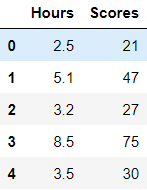

# Implementation-of-Linear-Regression-Using-Gradient-Descent

## AIM:
To write a program to implement the linear regression using gradient descent.

## Equipments Required:
1. Hardware – PCs
2. Anaconda – Python 3.7 Installation / Moodle-Code Runner

## Algorithm
1. Import the standard libraries in python for finding linear regression.
2. Assign a variable 'dataset' for reading the content in given csv file.
3. Split the supervised data and unsupervised data in the dataset using train_test_split method.
4. Using training and test values on dataset, predict the linear line .
5. Assign the points for representing in the graph
6. Predict the regression for marks by using the representation of the graph.
7. Compare the graphs and hence we obtained the linear regression for the given datas.

## Program:
```
/*
Program to implement the linear regression using gradient descent.
Developed by: Shafeeq Ahamed.S
RegisterNumber: 212221230092
*/
import pandas as pd
import numpy as np
import matplotlib.pyplot as plt
from sklearn.linear_model import LinearRegression
df=pd.read_csv('student_scores - student_scores.csv')
df.head()
df.tail()

#checking for null values in dataset
df.isnull().sum()

#To calculate Gradient decent and Linear Descent
x=df.Hours
x.head()

y=df.Scores
y.head()

n=len(x)
m=0
c=0
L=0.001
loss=[]
for i in range(10000):
    ypred = m*x + c
    MSE = (1/n) * sum((ypred - y)*2)
    dm = (2/n) * sum(x*(ypred-y))
    dc = (2/n) * sum(ypred-y)
    c = c-L*dc
    m = m-L*dm
    loss.append(MSE)
print(m,c)

#plotting Linear Regression graph
print("Slope = {}\nConstant = {}".format(m,c))
y_pred=m*x+c
plt.scatter(x,y,color="magenta")
plt.plot(x,y_pred,color="red")
plt.xlabel("Study Hours")
plt.ylabel("Scores")
plt.title("Study hours vs Scores")
plt.show()

#plotting Gradient Descent graph
plt.plot(loss, color="darkblue")
plt.xlabel("Iterations")
plt.ylabel("Loss")
plt.show()
```
## Output:
### Contents in the data file (head, tail):


### Checking for null values in the dataset:

### X and Y datasets from original dataset:


### Linear Regression Graph:

### Gradient Descent Graph:


## Result:
Thus the program to implement the linear regression using gradient descent is written and verified using python programming.